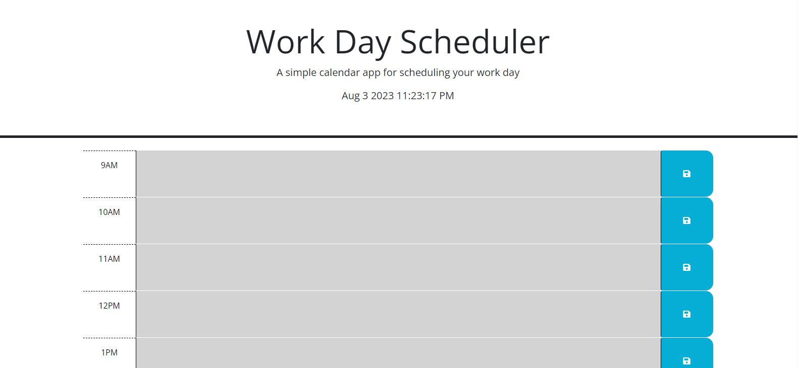

# Day Calendar

## User Story
AS AN employee with a busy schedule
I WANT to add important events to a daily planner
SO THAT I can manage my time effectively

## What I did
I was able to change the class of the textarea elements to either past, present or future based on the current hour. I also made the save button save the text in the text area to the local storage

